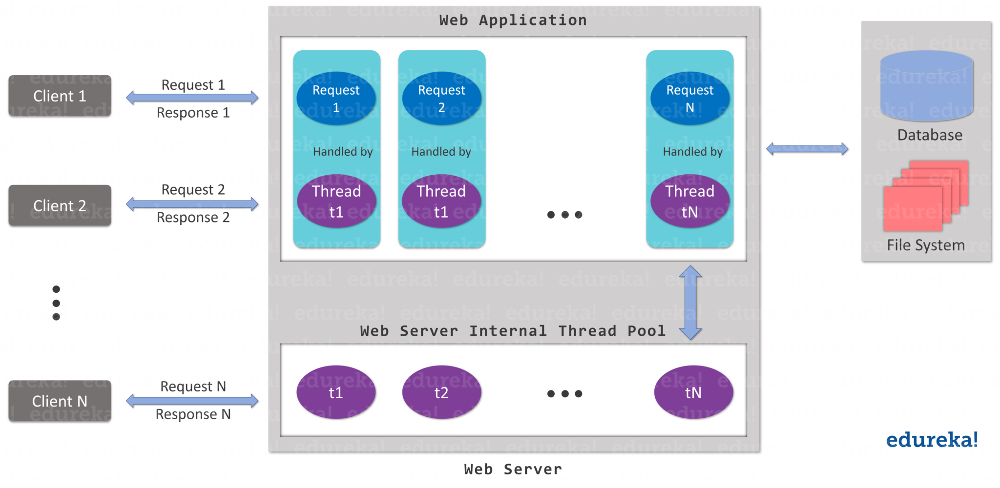
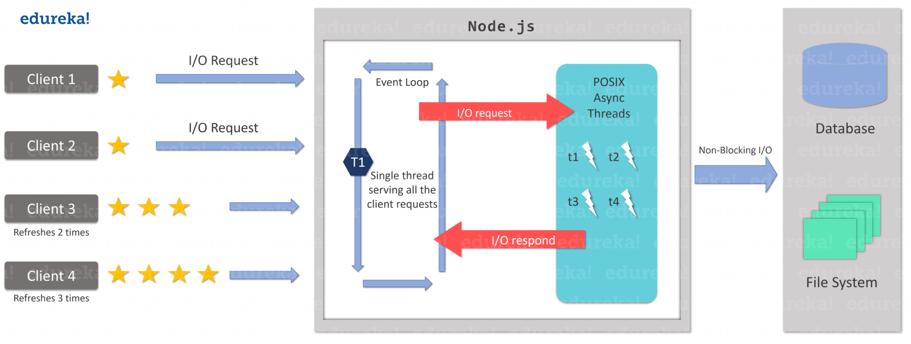

# nodejs_cookbook
Node.js is a powerful JavaScript framework that is developed on Chrome’s V8 JavaScript engine. It helps in compiling [JavaScript](https://www.edureka.co/blog/what-is-javascript/) directly into the native machine code.Node.js extends JavaScript API which enables the usual server-side functionalities as well. It is generally used for large-scale application development, especially for video streaming sites, single-page application, and other web applications. Node.js makes use of an event-driven, non-blocking I/O model which makes it a right pick for the data-intensive real-time applications.

Here are the outline:

* <a href="#architect">Architecture</a>
* <a href="#rest-api">REST API</a>
* <a href="#npm">NPM</a>
* <a href='#packages'>Packages</a>
  * <a href="#nodemon">nodemon</a>
  * <a href="#express">Express.js</a>
  * <a href="#http">HTTP packages</a>
  * <a href="websocket">WebSocket</a>

## <div id="architect">Architecture</div>

Generally, the server-side technologies like [PHP](https://www.edureka.co/blog/php-tutorial-for-beginners/), ASP.NET, [Ruby](https://www.edureka.co/blog/ruby-on-rails-tutorial/) & [Java](https://www.edureka.co/blog/java-tutorial/) Servers all follow a multi-threaded model. In this traditional architectural approach, each client request creates a new thread or a process.



To avoid this, Node.js uses **Single Threaded Event Loop Model** **Architecture**. It means that all the client requests on Node.js are executed on the same thread. But this architecture is not just single-threaded, but event-driven as well. It helps Node.js in handling multiple clients concurrently. Below diagram, represents the Single Threaded Event Loop Model architecture.



## <div id="rest-api">REST API</div>

**RE**presentational **S**tate **T**ransfer. It is an architectural style as well as an approach for communications purposes that is often used in various web services development. It is an application program interface (API) that makes use of the HTTP requests to GET, PUT, POST and DELETE the data over WWW.


## <div id="npm">NPM</div>

NPM stands for Node Package Manager, the default package manager of Node.js that is completely written in JavaScript.

It provides online repositories for packages/modules for Node.js which you can easily search online on their [official site](https://www.npmjs.com/).

It also provides a Command Line Interface (CLI) which helps the developers in locally interacting with their systems.

* npm version: 

  ```bash
  npm -v
  ```

* Initialize:

  ```bash
  npm init
  ```

  Node.js will ask you to enter some details to build .json file

* Install packages

  ```bash
  npm install <package-name> # locally
  npm install -g <package-name> # globally
  npm install <package_name> --save # requested module added to package.json
  npm list -g --depth 0 # check global packages
  ```

* package.json

  *Main:* Points to the entry point/file of the application

  *Scripts:* Contains the list of scripts which are required to be included in the application to execute properly

  *Dependencies:* Depicts the list of 3rd Party packages or modules installed using NPM

  *DevDependencies:* Dependencies that are used only in the development part of the app are specified here

* package-lock.json
package-lock.json is automatically generated for any operations where npm modifies either the node_modules tree, or package.json. It describes the exact tree that was generated, such that subsequent installs are able to generate identical trees, regardless of intermediate dependency updates. One key detail about package-lock.json is that it cannot be published, and it will be ignored if found in any place other than the toplevel package.

## <div id="packages">Packages</div>

### <div id="nodemon">nodemon</div>

nodemon is a tool that helps develop node.js based applications by automatically restarting the node application when file changes in the directory are detected.

Installation:

```bash
npm install -g nodemon #globally
```

### <div id="express">Express.js</div>

[Express](https://expressjs.com/) is a minimal and flexible Node.js web application framework that provides a robust set of features for web and mobile applications.

* Example:

  ``` javascript
  //Importing express module
  const express = require('express') 
  //Creating an express module object
  const app = express() 
   
  //Creating Callback function and sending response
  app.get('/', (req, res) => res.send('Welcome to Edureka Demo!!!'))
   
  //Establish the server connection
  //PORT ENVIRONMENT VARIABLE
  const port = process.env.PORT || 8080;
  app.listen(port, () => console.log(`Listening on port ${port}..`));
  ```

* Routing methods:

  ```javascript
  app.METHOD(PATH, HANDLER)
  // app is an instance of express where you can use any variable.
  // METHOD is an HTTP request method such as get, set, put, delete.
  // PATH is the route to the server for a specific webpage.
  // HANDLER is the callback function that is executed when the matching route is found.
  ```

### <div id='http'> HTTP Request </div>

* HTTP Module
```javascript
const https = require("https");
const url = "<a href="https://my-json-server.typicode.com/edurekaDemo/noderequest/db">https://my-json-server.typicode.com/edurekaDemo/noderequest/db</a>";
https.get(url, res => {
res.setEncoding("utf8");
let body = "";
res.on("data", data => {
body += data;
});
res.on("end", () => {
body = JSON.parse(body);
console.log(body);
});
});
```

* Request Module

  ```javascript
  const request = require("request");
  const url = "<a href="https://my-json-server.typicode.com/edurekaDemo/noderequest/db">https://my-json-server.typicode.com/edurekaDemo/noderequest/db</a>";
  request.get(url, (error, response, body) => {
  let json = JSON.parse(body);
  console.log(body);
  });
  ```

* Axios Module

  It provides a single API for handling XMLHttpRequest and node’s HTTP interface, generally used when one is dealing with a complicated series of events. And since building asynchronous code can be really confusing, Promises has become one of the most prominent solutions to this problem.

  ``` javascript
  const axios = require("axios");
  const url = "<a href="https://my-json-server.typicode.com/edurekaDemo/noderequest/db">https://my-json-server.typicode.com/edurekaDemo/noderequest/db</a>";
  const getData = async url => {
    try {
      const response = await axios.get(url);
      const data = response.data;
      console.log(data);
    } catch (error) {
      console.log(error);
    }
  };
  getData(url);
  ```

### <div id="websocket">WebSocket</div>
The **WebSocket API** is an advanced technology that makes it possible to open a two-way interactive communication session between the user's browser and a server. In Nodejs, one of the package called [websocket](https://github.com/theturtle32/WebSocket-Node) are prefered by most people.

## Reference

* [edureka blog](https://www.edureka.co/blog/node-js-npm-tutorial/)
* 